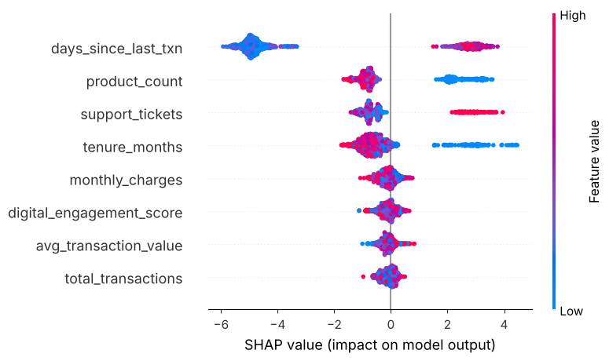
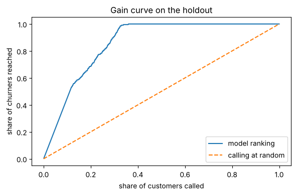

# Customer Churn Prediction: who is worth a call this week

A retention team cannot call every customer. So the useful question is not "will this customer leave" but "which customers do we call first, and what do we say to them".

This project ranks customers by churn risk with XGBoost, then uses SHAP to explain each prediction, so the agent making the call knows why that customer was flagged.

**Start here:** [`notebooks/churn_analysis.ipynb`](notebooks/churn_analysis.ipynb) runs the whole thing end to end, with outputs saved.

---

## Read this first: the data is synthetic

`src/features.py` generates 5,000 customers and decides who churns with fixed rules plus random noise: inactive over 30 days, tenure under 6 months, more than 2 support tickets, or holding a single product. That has two consequences, and both are stated up front rather than buried:

1. **Accuracy is unrealistically high.** The model is learning a formula, not human behaviour.
2. **The true drivers are known.** That makes it possible to test whether SHAP explains the model correctly, which you can never check on real data.

## The result that matters: SHAP found the planted drivers

Four features drive churn in the generator; the other four are pure noise. SHAP ranked exactly the four real drivers at the top, in a clear gap above the noise.



| Feature | Mean SHAP | Planted driver? |
|---|---|---|
| days_since_last_txn | 4.28 | yes |
| product_count | 1.26 | yes |
| support_tickets | 1.02 | yes |
| tenure_months | 0.85 | yes |
| monthly_charges | 0.23 | no |
| digital_engagement_score | 0.22 | no |
| avg_transaction_value | 0.19 | no |
| total_transactions | 0.18 | no |

## The business view: churners reached per call

Customers in the 20% holdout, ranked by predicted risk:

| Call the top | Share of all churners reached | Hit rate |
|---|---|---|
| 10% | 45% | 100% |
| 20% | 69% | 76% |
| 30% | 91% | 67% |



## Model metrics

Measured on a stratified 20% holdout the model never saw during training:

| Metric | Score |
|---|---|
| ROC-AUC (5-fold CV on training data) | 0.972 |
| ROC-AUC (holdout) | 0.962 |
| Precision | 0.68 |
| Recall | 0.90 |
| F1 | 0.77 |

**Correction:** an earlier version of this README reported ROC-AUC 0.891 with precision 0.84 and recall 0.79. Those figures did not come from this code, so they have been replaced with numbers the notebook reproduces.

The 0.5 threshold favours recall: it catches 9 in 10 churners at the cost of more wasted calls. In practice the threshold should come from the team's call capacity, which is what the ranking table above is for.

## Where it stops

| Area | Status |
|---|---|
| Training, holdout evaluation, SHAP, per-customer explanation | Working, in the notebook |
| `src/features.py` | RFM and engagement functions are written but not used by the model, which trains on the generated features |
| Hyperparameter tuning | Fixed parameters; Optuna is listed in requirements but not yet used |
| Serving | No prediction API yet |
| Real data | Not yet. Next step is running the same notebook on a public dataset such as IBM Telco churn and reporting those numbers instead |

## Run it

```bash
pip install -r requirements.txt
jupyter notebook notebooks/churn_analysis.ipynb
# or train from the command line
cd src && python train.py
```

## Project layout

```
notebooks/churn_analysis.ipynb   full analysis with outputs
src/features.py                  synthetic data generator, RFM and engagement features
src/train.py                     training script with cross-validation
reports/                         SHAP and gain curve charts
```

## Stack

Python, pandas, scikit-learn, XGBoost, SHAP, matplotlib
